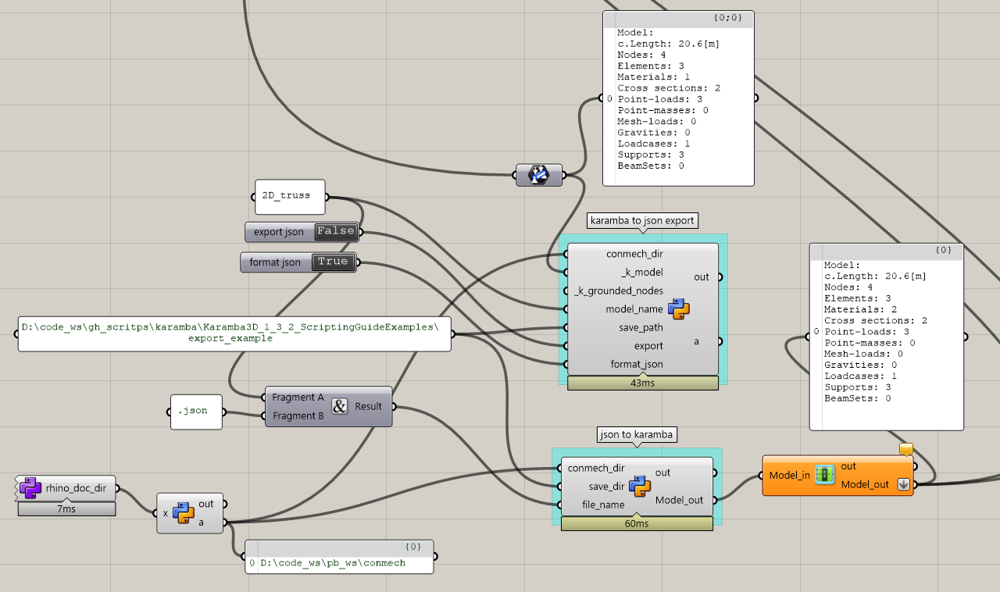

=======
conmech
=======

.. start-badges

.. image:: https://travis-ci.com/yijiangh/conmech.svg?branch=master
    :target: https://travis-ci.com/yijiangh/conmech
    :alt: Travis CI

.. image:: https://ci.appveyor.com/api/projects/status/k0f10bas2fj4uqww?svg=true
    :target: https://ci.appveyor.com/project/yijiangh/conmech
    :alt: Appveyor CI

.. image:: https://readthedocs.org/projects/conmech/badge/?version=latest
    :target: https://conmech.readthedocs.io/en/latest/?badge=latest
    :alt: Documentation Status

.. image:: https://img.shields.io/github/license/yijiangh/conmech
    :target: ./LICENSE
    :alt: License MIT

.. image:: https://img.shields.io/badge/python-3.6|3.7-blue
    :target: https://pypi.org/project/pyconmech/
    :alt: PyPI - Python Version

.. image:: https://coveralls.io/repos/github/yijiangh/conmech/badge.svg?branch=master
    :target: https://coveralls.io/github/yijiangh/conmech?branch=master
    :alt: Coveralls

.. .. image:: https://img.shields.io/badge/pypi-v0.3.1-orange
    :target: https://pypi.org/project/pyconmech/
    :alt: PyPI - Latest Release

.. end-badges

.. Write project description

**conmech** is a stiffness checker that performs elastic deformation analysis for 3D frame structures. 
It is designed for construction sequencing applications, which involves testing
the partially assembled structure (subset of the element permutation) many times.

For now, **conmech** only supports first-order linear FEM simulations of 2D/3D frame structures 
(similar to the `Analyze <https://manual.karamba3d.com/3-in-depth-component-reference/3.5-algorithms/3.5.1-analyze>`_ component in Karamba),
but stay tune for a shell analysis backend coming soon ☕!

**conmech** has a high-performing `C++` backend (written in C++11 and wrapped friendly with Python via `pybind11 <https://github.com/pybind/pybind11>`_) and 
a flexible, but less performative `numpy` backend.

🚧 The `C++` backend is under development to keep up with the latest feature
implemented in the `numpy` backend. Please use the `numpy` backend until the next release.

Usage
-----

Input model
^^^^^^^^^^^

There are two ways to specify and input a structural model (geometry, material, cross sections, joint releases, support conditions, and loads)
to conmech: 

(1) directly input data following class structures specified in `pyconmech.frame_analysis.io_base`
(2) write your data in a `JSON` format and input the file path to conmech (See `file examples here <https://github.com/yijiangh/conmech/tree/master/tests/test_data>`_.

The easiest way to generate the model JSON file by exporting from a `Karamba3D`_ model in `Rhino-Grasshopper`_. 
A `example GH export file <https://github.com/yijiangh/conmech/tree/master/examples/gh_scripts/karamba/export_from_karamba.gh>`_ is provided:

You can also parse your model JSON file back to Rhino/GH for visualization/debugging by using the `parse GH example file <https://github.com/yijiangh/conmech/tree/master/examples/gh_scripts/parse_frame_json_conmech.ghx>`_.

Analysis
^^^^^^^^

After you have the input model ready, analysis is straight-forward:

.. code-block:: python

    from pyconmech import StiffnessChecker

    sc = StiffnessChecker.from_json(json_file_path=frame_file_path, checker_engine="numpy", verbose=True)
    gravity_load = GravityLoad([0,0,-1]) 
    sc.set_loads(gravity_load=gravity_load)

    # if the structure's nodal deformation exceeds 1e-3 meter, 
    # we want the checker to return `sol_success = False`
    trans_tol = 1e-3
    sc.set_nodal_displacement_tol(trans_tol=trans_tol)

    # existing elements' indices
    existing_ids = [0,4,88,6]

    # False if the analysis result
    sol_success = sc.solve(existing_ids)

    # Get all the analysis information:
    # nodal deformation, fixity reactions, element reactions
    success, nD, fR, eR = sc.get_solved_results()

See `python unit tests <https://github.com/yijiangh/conmech/blob/master/tests/python/test_stiffness_checker.py>`_ for more examples.

Installation
------------

::

  python -m pip install pyconmech --user
  # or python3 if default python is 2.x (OSX or Linux)
  # try the following flags when updating: --user --upgrade --force

Build from source
-----------------

Build python bindings
^^^^^^^^^^^^^^^^^^^^^

Prerequisites
"""""""""""""

The following dependencies come from pybind11 for building the python wrappers.

**On Unix (Linux, OS X)**

* A compiler with C++11 support
* CMake >= 3.1

**On Windows**

* Visual Studio 2015 (required for all Python versions, see notes below)
* CMake >= 3.1

Then, clone this repository and pip install.

::

  cd conmech
  python -m pip install .
  # or python3 if default python is 2.x (OSX or Linux)
  # try the following flags when updating: --user --upgrade --force 

With the ``setup.py`` file included in the base folder, the pip install command will invoke CMake and build the pybind11 module as specified in CMakeLists.txt.

**Note:**

*conmech*'s python bindings are built with a CMake-based build system via pybind11.
Take a look at `cmake_example for pybind11 <https://github.com/pybind/cmake_example>`_ 
if you want to learn more about this.

*conmech* depends on `Eigen <http://eigen.tuxfamily.org/index.php?title=Main_Page>`_ for linear algebra 
and `nlohmann::json <https://github.com/nlohmann/json>`_ 
for json (de-)serialization, both of which are handled automatically by cmake for downloading.

Build C++ code
^^^^^^^^^^^^^^

::

  mkdir build
  cd build
  cmake ..
  make -j2 # Unix

Or on Windows, replace the last line with

::

  cmake --build .

References
----------

Credits
^^^^^^^

    Yijiang Huang. Conmech. https://pypi.org/project/pyconmech/. 2020.

This package was initiated and maintained by Yijiang Huang `@yijiangh <https://github.com/yijiangh>`_
and other `contributors <https://github.com/yijiangh/conmech/blob/master/AUTHORS.rst>`_.

References
^^^^^^^^^^^^^

The following textbook is an excellent resource for learning 2D/3D truss/frame analysis, many of 
`conmech`'s unit tests are using examples in this textbook as analytical benchmarks:

    McGuire, W., R. H. Gallagher, and R. D. Ziemian. "Structural Analysis, Title: Matrix Structural Analysis." (2015).

Related repos
^^^^^^^^^^^^^

`Frame3dd`_: A static and dynamic structural analysis software of 2D and 3D frames and trusses with elastic and geometric stiffness written in `C`.

.. -----------------

.. _Karamba3D: https://www.karamba3d.com/
.. _Frame3dd: http://frame3dd.sourceforge.net/
.. _Rhino-Grasshopper: https://www.rhino3d.com/6/new/grasshopper