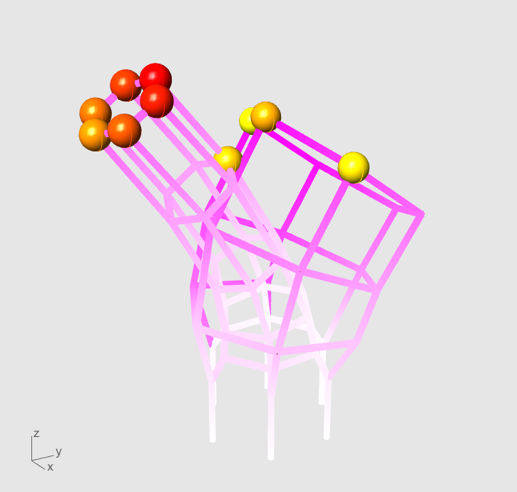
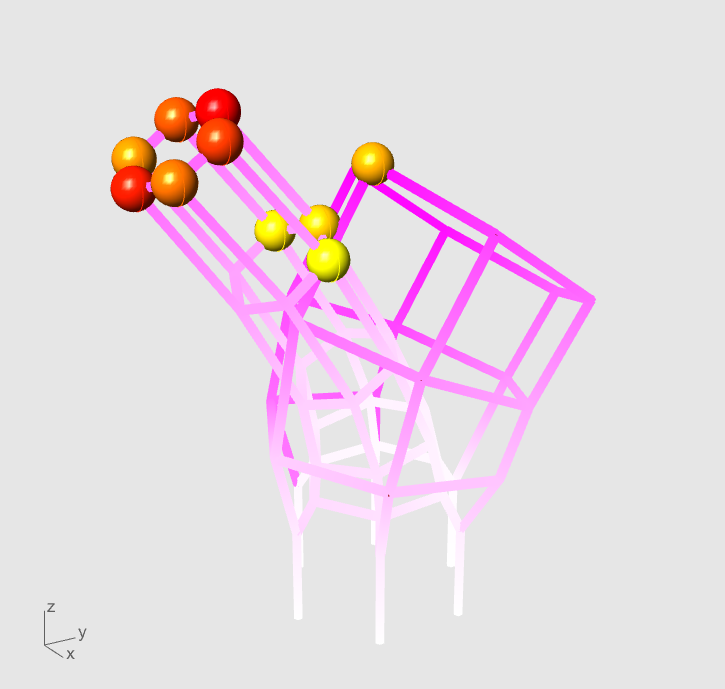
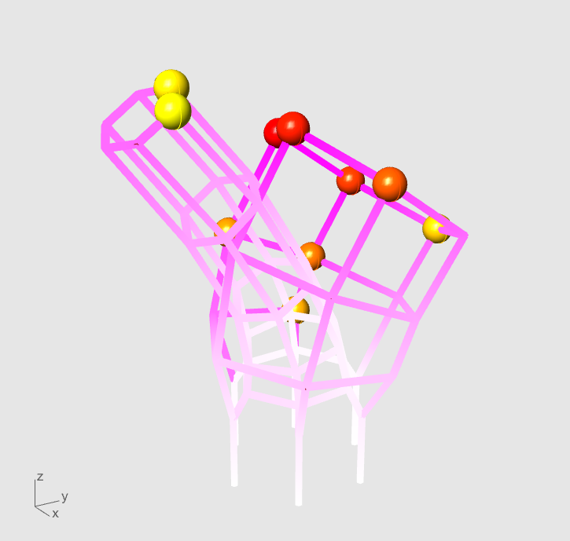
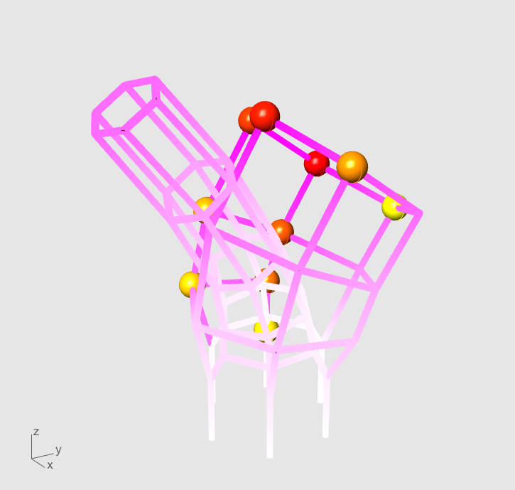

karamba_comparision
-------------------

klein_bottle_trail.json (gravity scale = 1)

conmech results
^^^^^^^^^^^^^^^

node ordering metric: max_coordinate

node ordering metric: max translational norm

karamba results
^^^^^^^^^^^^^^^

+---------------------------------------+-------------------+-------------------+
|  conmech lumped load                  |        Karamba gravity                |
+-------------------+-------------------+-------------------+-------------------+
|     max norm      |   max coordinate  |     max norm      |   max coordinate  |
+---------+---------+---------+---------+---------+---------+---------+---------+
| karamba | conmech | karamba | conmech | karamba | conmech | karamba | conmech |
+---------+---------+---------+---------+---------+---------+---------+---------+
|0.000035 | 0.00352 | 0.000025| 0.003102| 0.000034| 0.00352 | 0.000025| 0.003102|
+---------+---------+---------+---------+---------+---------+---------+---------+

conmech lumped load
""""""""""""""""""""""""""""""""

node ordering metric: max_coordinate

.. image:: ../images/karamba_conmech_lumped_load_max_coordinate.png

node ordering metric: max translational norm

Applying karamba gravity
""""""""""""""""""""""""""""""""

node ordering metric: max_coordinate

node ordering metric: max translational norm

.. image:: ../images/karamba_karamba_gravity_max_norm.png