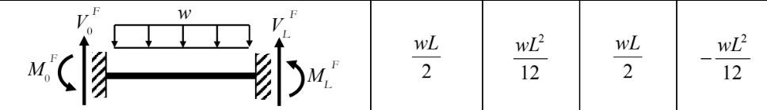

Self-weight gravity load
------------------------

We lump the uniformly distributed load caused by gravity to the two ends of the beam.
The load density is :math:`\rho A g_{z} = \frac{\rho A L \cdot g_{z}}{L}` in the global z axis.
We want to use the fix-ended uniform load beam
results above to lump the load to the two beam ends.

In this document, :math:`\rho` indicates the density
of the element's material; :math:`A` indicates the
element's cross section area, :math:`L` indicates the length of the element. For the subsribe convention, :math:`F_{0,G,x}^e` means the value is
element ``e`` 's end point ``0`` 's force in ``G`` lobal coordinate system's ``x`` axis.
Another example here: :math:`M_{L,L,z}^e` means the value is element ``e`` 's end point ``L`` 's moment in ``L`` ocal coordinate system's ``z`` axis.

For the force part, we can simply divide them by
two, as the load itself is given in the global
coordinate system initially:

.. math::

  \begin{pmatrix}
  F_{0x}, F_{0y}, F_{0z}
  \end{pmatrix}^T =
  \begin{pmatrix}
  w_x \frac{L}{2}, w_y \frac{L}{2}, w_z \frac{L}{2}
  \end{pmatrix}^T

.. math::

  \begin{pmatrix}
  F_{Lx}, F_{Ly}, F_{Lz}
  \end{pmatrix}^T =
  \begin{pmatrix}
  w_x \frac{L}{2}, w_y \frac{L}{2}, w_z \frac{L}{2}
  \end{pmatrix}^T

Where :math:`w_{x,y,z} = \rho A g_{x,y,z}`. Usually, :math:`w_{x}, w_{y} = 0`, and :math:`g_z` represents the gravitational acceleration.

For the moment part, we need to first transform the across-span load to the element's load coordinate system, and then we can use the fixed-end beam equation's results.

First, we have the element's *local-to-global* 3x3 transformation matrix :math:`R_{LG}^e`.

Then the load density in the local coordinate is:

.. math::

  \begin{pmatrix}
  w_{Lx}\\
  w_{Ly}\\
  w_{Lz}
  \end{pmatrix} =
  (\rho A)
  R_{LG} \cdot
  \begin{pmatrix}
  g_x\\
  g_y\\
  g_z
  \end{pmatrix}

Then, because the moment is activated by loads that are perpendicular to the local x axis, we only need to consider the :math:`w_{Ly}, w_{Lz}`'s contribution to the moment reaction.

Loads along the positive local y axis direction will activate **positive** moment reaction at end point ``0`` and **negative** moment reaction at end point ``L`` around **local z axis**.

TODO: picture

Loads along the positive local z axis direction will activate **negative** moment reaction at end point ``0`` and **positive** moment reaction at end point ``L`` around **local y axis**.

TODO: picture

According to the fixed-end beam equation, the reaction moment's value is :math:`\frac{w_{local} L^2}{12}`.
The reaction moment caused by :math:`w_{Lxyz}` is

.. math::

  \begin{pmatrix}
  M_{0,Lx}\\
  M_{0,Ly}\\
  M_{0,Lz}\\
  M_{L,Lx}\\
  M_{L,Ly}\\
  M_{L,Lz}
  \end{pmatrix} =
  \begin{pmatrix}
  0\\
  -w_{Lz} L^2/2\\
  w_{Ly} L^2/2\\
  0\\
  w_{Lz} L^2/2\\
  -w_{Ly} L^2/2
  \end{pmatrix}

Transforming it back to the global coordinate:

.. math::

  \begin{pmatrix}
  M_{0,Gx}\\
  M_{0,Gy}\\
  M_{0,Gz}\\
  M_{L,Gx}\\
  M_{L,Gy}\\
  M_{L,Gz}
  \end{pmatrix} =
  \begin{pmatrix}
  R_{LG}^T &0\\
  0 &R_{LG}^T\\
  \end{pmatrix}
  \begin{pmatrix}
  0\\
  -w_{Lz} L^2/2\\
  w_{Ly} L^2/2\\
  0\\
  w_{Lz} L^2/2\\
  -w_{Ly} L^2/2
  \end{pmatrix}
