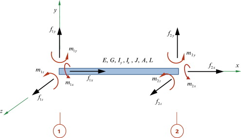

StiffnessChecker output explained
---------------------------------

We have three outputs from the ``StiffnessChecker``:

nodal deformation
^^^^^^^^^^^^^^^^^

Each node is associated with a 6 dimensional vector: 

.. math::
    
    \begin{pmatrix}
    d_{Gx}, d_{Gy}, d_{Gz}, \theta_{Gx}, \theta_{Gy}, \theta_{Gz}
    \end{pmatrix}

Here the subscript :math:`G\,\cdot` means the displacements are described in the **global coordinate system**.

element reaction
^^^^^^^^^^^^^^^^

Each element is associated with a 13-dimensional vector:

.. math::

    \begin{pmatrix}
    F^{n1}_{Lx}, F^{n1}_{Ly}, F^{n1}_{Lz}, M^{n1}_{Lx}, M^{n1}_{Ly}, M^{n1}_{Lz}, F^{n2}_{Lx}, F^{n2}_{Ly}, F^{n2}_{Lz}, M^{n2}_{Lx}, M^{n2}_{Ly}, M^{n2}_{Lz}
    \end{pmatrix}

Each of these vectors describes the element's internal reaction force and moment 
at the two end points.

Here :math:`n1, n2` refer to the end nodes of this element. :math:`F_{L\,\cdot}` 
and :math:`M_{L\,\cdot}` refer to the element's internal force and moment 
**under the element's local coordinate system**. 

By convention, the local cooridinate system is constructed by setting the 
origin to node :math:`n1`, and the local x axis as the direction from 
:math:`n1` to :math:`n2` (see picture below). The local y axis is 
constructed by simply checking if the element's local x axis is aligned 
with the global z axis, and construct the local y axis by taking cross 
product between the local x axis and the global z. 

PS: This extra degree of freedom in choosing local y axis makes it very 
hard to compare our internal element reaction results with an existing FEM solver.

`image source <https://www.sciencedirect.com/topics/engineering/moment-distribution>`__

fixities reaction
^^^^^^^^^^^^^^^^^

Each fixed node is associated with a 6-dimensional vector:

.. math::

    \begin{pmatrix}
    F_{Gx}, F_{Gy}, F_{Gz}, M_{Gx}, M_{Gy}, M_{Gz}
    \end{pmatrix}

Here the forces and moments are described in 
**global coordinate system**.

The relationship between `fixities reaction` and `element reaction`
^^^^^^^^^^^^^^^^^^^^^^^^^^^^^^^^^^^^^^^^^^^^^^^^^^^^^^^^^^^^^^^^^^^^

Since we are dealing with fully constrained elastic frame structures 
(all the frame nodes and fixities are 6-dof fixed), 
a partially assembled structure will never collapse because of 
mechanism, as long as it does not have unconnected, floating elements. 
Or in other words, reaction force will be in equilibrium at each node 
(no matter they are grounded or not).

For nodes that are not fixities
""""""""""""""""""""""""""""""""

For nodes that are not fixities, the forces are from 
connected elements' internal reaction force and loads. 
So the force equilibrium at this node :math:`v` is:

.. math::

    \sum_{e \in \{e | e \sim v\}} 
    \begin{pmatrix}
    R_{e, GL} & 0 \\ 0 & R_{e, GL}
    \end{pmatrix}
    \begin{pmatrix}
    F^{v}_{e, Lx} \\ 
    F^{v}_{e, Ly} \\ 
    F^{v}_{e, Lz} \\ 
    M^{v}_{e, Lx} \\ 
    M^{v}_{e, Lx} \\ 
    M^{v}_{e, Lz} 
    \end{pmatrix} = 
    \sum_{e \in \{e | e \sim v\}} 
    (F_{v, \textrm{e self-w load}}) + F_{v, \textrm{pt load}}

Where :math:`R_{e, GL}` is the :math:`3 \times 3` 
global to local rotation matrix of element :math:`e`. 
The element internal reaction 
:math:`\begin{pmatrix}F^{v}_{e, Lx}, F^{v}_{e, Ly}, F^{v}_{e, Lz}, 
M^{v}_{e, Lx}, M^{v}_{e, Lx}, M^{v}_{e, Lz} \end{pmatrix}` 
is the entries that we get from element :math:`e`'s 
corresponding entry in `element_reaction`. 
This vector is descirbed in local coordinate of element :math:`e`, 
and that's why we need to use the rotation matrix :math:`R_{e, GL}` 
to transform it back to global coordinate, 
so that we can have all the element's reaction force 
described in the same system.

Notice that each row of `element_reaction` contains two such 6 
dimensional vectors, corresponding to two end point of element :math:`e`. 
(We do not have a convienient API to help us know which node index 
these two 6-dim vectors are referring to now. 
But I can add one if we need it.)

The force :math:`F_{v, \textrm{e self-w load}}` 
is the lumped self-weight of the element :math:`e` 
described in the global coordinate. We will talk about this 
formation of this self-weight load in more detail in another section. 

The :math:`F_{v, \textrm{pt load}}` refers to extra loads 
that are specified on the node. We don't have this in our 
`pb-construction` sequencing context 
(but "classic structural analysis" usually works with these 
point load scenarios!)

The summation over all the connected element :math:`e \in 
\{e | e \sim v\}` means that both the number of internal force 
and the self-weight load will be changing when we are 
considering different partially assembled structures. 
Indeed, within the implementation of `StiffnessChecker`, 
we pre-calculate all the **element-wise stiffness matrices** and 
**self-weight loads**, both of which are in global coordinate. 
Whenever we feed the checker with a set of exisiting element ids, 
we simply assembly corresponding element's stiffness matrix and 
load vector together to form a structure-wise linear system and 
solve it. By doing this, we are not doing repetitive calculation.

For nodes that are fixities
""""""""""""""""""""""""""""

For nodes that are fixities, the forces are from 
connected elements' internal reaction force and the reaction 
force from the ground (fixities). So the force equilibrium 
at this node :math:`v` is:

.. math::

    \sum_{e \in \{e | e \sim v\}} 
    \begin{pmatrix}
    R_{e, GL} & 0 \\ 
    0 & R_{e, GL}
    \end{pmatrix}\begin{pmatrix}
    F^{v}_{e, Lx} \\ 
    F^{v}_{e, Ly} \\ 
    F^{v}_{e, Lz} \\ 
    M^{v}_{e, Lx} \\ 
    M^{v}_{e, Lx} \\ 
    M^{v}_{e, Lz} 
    \end{pmatrix} = 
    \begin{pmatrix}
    RF^{v}_{Gx} \\ 
    RF^{v}_{Gy} \\ 
    RF^{v}_{Gz} \\ 
    RM^{v}_{Gx} \\ 
    RM^{v}_{Gx} \\ 
    RM^{v}_{Gz} 
    \end{pmatrix}

Where :math:`R_{e, GL}` is the :math:`3 \times 3` 
global to local rotation matrix of element :math:`e`. 
Here the :math:`RF^{v}_{G\cdot}` and 
:math:`RM^{v}_{G\cdot}` refer to the fixity reaction force 
and moment in the global coordinate.